# Struktur Organisasi EDTECH-ID

Teknologi Pendidikan ID (EDTECH-ID) merupakan organisasi nirlaba yang bergerak di bidang pendidikan dan teknologi. EDTECH-ID bergerak secara independen, otonom dan tidak terafiliasi dengan instansi pemerintahan maupun partai politik manapun.

EDTECH-ID dalam pengelolaanya dipimpin oleh jajaran direktur organisasi. Direktur organisasi merupakan para pendiri dari organisasi EDTECH-ID. Direktur organisasi bertanggung jawab atas seluruh operasional organisasi dan melaporkan kepada para anggota organisasi EDTECH-ID.

Dalam menjalankan operasional EDTECH-ID, para direktur organisasi dibantu oleh para anggota organisasi yang tersebar dalam lembaga lembaga sesuai dengan bidang tugasnya. Lembaga - lembaga tersebut meliputi:

1. Pengembang dan Pelaksana Tugas Strategis yang terdiri atas:
   1. Direktorat Program Akademik dan Kependidikan
   2. Direktorat Perencanaan, Manusia dan Keuangan
   3. Direktorat Pengembangan Teknologi dan Sistem Informasi
   4. Direktorat Inovasi, Komunikasi dan Kerjasama
2. Pelaksana program akademik yang terdiri atas:
   1. Balai peningkatan kompetensi manusia
   2. Lembaga pengembangan pendidikan dan pembelajaran
3. Penunjang operasional akademik dan nonakademik yang terdiri atas:
   1. UPT Pusat Sumber Belajar

Diagram atau bahan visualisasi struktur organisasi EDTECH-ID dapat dilihat pada gambar berikut:

```mermaid
flowchart TD
    DO[Direktur Organisasi]
    DO --> DPAK[Direktur Program Akademik dan Kependidikan]
    DPAK --> SAPD[Kepala Subdit Admmisi dan Pangkalan Data]
    DPAK --> SP[Kepala Subdit Program]
    DPAK --> SME[Kepala Direktorat Monitoring dan Evaluasi]

    DO --> DPMK[Direktur Perencanaan, Manusia dan Keuangan]
    DPMK --> SPR[Kepala Subdit Perencanaan]
    DPMK --> SSDM[Kepala Subdit Sumber Daya Manusia]
    DPMK --> SSK[Kepala Subdit Keuangan]

    DO --> DPTSI[Direktur Pengembangan Teknologi dan Sistem Informasi]
    DPTSI --> SALT[Kepala Subdit Aplikasi dan Layanan Terpadu]
    DPTSI --> SIKS[Kepala Subdit Infrastruktur dan Keamanan Siber]
    DPTSI --> STDI[Kepala Subdit Teknologi Data dan Informasi]

    DO --> DIKK[Direktur Inovasi, Komunikasi, dan Kerjasama]
    DIKK --> SI[Kepala Subdit Inovasi]
    DIKK --> SIKK[Kepala Subdit Komunikasi dan Kerjasama]

    DO --> BPKM[Kepala Balai Peningkatan Kompetensi Manusia]
    BPKM --> BS[Ketua Bidang Studi]
    BPKM --> KALAB[Staff Ahli Laboratorium]

    DO --> LPPP[Ketua Lembaga Pengembangan Pendidikan dan Pembelajaran]
    DO --> PSB[Kepala UPT Pusat Sumber Belajar]
```

## Pengembang dan Pelaksana Tugas Strategis

Direktorat merupakan unsur atau lembaga pengembang, pelaksana tugas strategis dan pelaksana administrasi dari suatu bidang tertentu. Direktorat dipimpin oleh seorang direktur yang bertanggung jawab atas seluruh operasional direktorat dan melaporkan kepada direktur organisasi. Dalam melaksanakan tugasnya, direktur dibantu oleh para anggota yang tersebar dalam lembaga lembaga sesuai dengan bidang tugas direktorat.

Berikut adalah direktorat yang ada di EDTECH-ID:

1. Direktorat Program Akademik dan Kependidikan
2. Direktorat Perencanaan, Manusia dan Keuangan
3. Direktorat Pengembangan Teknologi dan Sistem Informasi
4. Direktorat Inovasi, Komunikasi dan Kerjasama

### Direktorat Program Akademik dan Kependidikan

Direktorat yang melakukan pengembangan program akademik, kependidikan dalam bentuk kurikulum, materi, dan kegiatan kepelatihan.

Direktorat Program Akademik dan Kependidikan terdiri dari sub direktorat yang meliputi:

1. Subdirektorat Admisi & Pangkalan Data
2. Subdirektorat Program
3. Subdirektorat Monitoring dan Evaluasi

### Direktorat Perencanaan, Manusia dan Keuangan

Direktorat yang melakukan pengembangan perencanaan, pengembangan sumber daya manusia dan pengembangan keuangan dalam lingkup organisasi.

Direktorat Perencanaan, Manusia dan Keuangan terdiri dari sub direktorat yang meliputi:

1. Subdirektorat Perencanaan
2. Subdirektorat Sumber Daya Manusia
3. Subdirektorat Keuangan

### Direktorat Pengembangan Teknologi dan Sistem Informasi

Direktorat yang melakukan pengembangan teknologi dan sistem informasi dalam lingkup organisasi.

Direktorat Pengembangan Teknologi dan Sistem Informasi terdiri dari sub direktorat yang meliputi:

1. Subdirektorat Aplikasi dan Layanan Terpadu
2. Subdirektorat Infrastruktur dan Keamanan Siber
3. Subdirektorat Teknologi Data dan Informasi

### Direktorat Inovasi, Komunikasi dan Kerjasama

Direktorat yang melakukan pengembangan inovasi, komunikasi dan kerjasama dalam lingkup organisasi.

Direktorat Inovasi, Komunikasi dan Kerjasama terdiri dari sub direktorat yang meliputi:

1. Subdirektorat Inovasi
2. Subdirektorat Komunikasi dan Kerjasama

## Pelaksana Program Akademik

Pelaksana program akademik adalah unsur yang melaksanakan dan mengelola program layanan akademik dan kependidikan bagi para peserta program kependidikan. Pelaksanaan program yang dilakukan oleh bidang ini menyesuikan dan berkoordinasi dengan [Direktorat Program Akademik dan Kependidikan](#direktorat-program-akademik-dan-kependidikan).

### Balai Peningkatan Kompetensi Manusia

Balai Peningkatan Kompetensi Manusia adalah lembaga yang menyelenggarakan dan mengelola pendidikan akdemik dalam suatu rumpun disiplin ilmu pengetahuan dan teknologi. Unsur - unsur di dalam balai ini terdiri dari:

1. Bidang Studi
2. Laboratorium

**Bidang Studi**

Bidang studio merupakan unsur pelaksana akademik yang menjalankan fungsi pengelolaan proses pendidikan dan pembelajaran yang memiliki kurikulum dam metode pembelajaran tertentu dalam satu jenis rumpun disiplin ilmu pengetahuan dan teknologi. 

**Laboratorium**

Laboratorium merupakan unsur penunjang pelaksanaan akademik yang secara khusus menangani kegiatan eksperimentasi, pengujian dan pengembangan teknologi. Laboratorium dipimpim oleh sorang tenaga ahli laboratorium yang memiliki kompetensi sesuai dengan bidang keahlian laboratorium. 

### Lembaga Pengembangan Pendidikan dan Pembelajaran

Lembaga Pengembangan Pendidikan dan Pembelajaran adalah lembaga yang melaksakana pengembangan pendidikan dan pembelajaran. Lembaga ini dipimpin oleh seorang 

## Penunjang Operasional Akademik dan Nonakademik

Penunjang operasional akademik dan nonakademik adalah unsur yang menyediakan layanan terhadap operasional akademik dan nonakademik dalam organisasi. Pelaksanaan layanan dilakukan oleh Unit Pelaksana Teknis (UPT) yang dipimpin oleh kepala UPT yang bertanggung jawab pada direktur. Pelaksanaan program yang dilakukan oleh bidang ini menyesuikan dan berkoordinasi dengan direktorat yang sesuai dengan bidang tugas masing - masing.

### UPT Pusat Sumber Belajar

UPT Pusat Sumber Belajar adalah unsur yang menyelenggarakan dan mengelola layanan lingkunan dan sumber belajar bagi para peserta progam pendidikan maupun lembaga organisasi. UPT ini dipimpin oleh seorang kepala UPT.