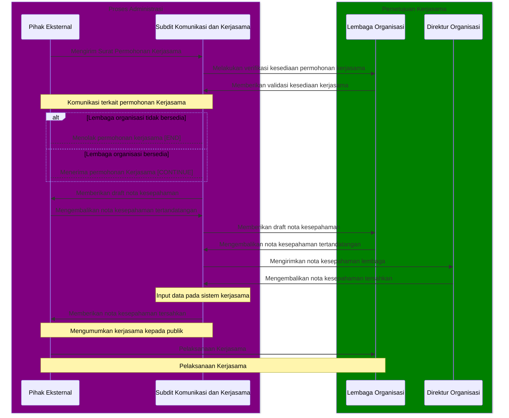

# Alur Pengajuan Kerjasama

Untuk mempermudah proses pengajuan kerjasama dengan Teknologi Pendidikan ID, kami telah menyiapkan alur pengajuan kerjasama yang dapat diikuti oleh pihak eksternal yang ingin bekerjasama dengan kami. Terdapat beberapa tahapan yang harus dilalui oleh pihak eksternal sebelum kerjasama dapat dilakukan. Kami mohon secara seksama untuk membaca alur pengajuan kerjasama ini sebelum mengajukan kerjasama dengan kami agar proses penerimaan kerjasama dapat berjalan dengan lancar dan tidak bertele - tele.

## Alur Pengajuan Kerjasama

1. Surat permohonan kerjasama ditujukan kepada Direktur Organisasi Teknologi Pendidikan ID melalui email ke alamat [kerjasama@teknologipendidikan.or.id](mailto:kerjasama@teknologipendidikan.or.id) dengan melampirkan berkas berikut:
    1. Surat Permohonan Kerjasama
    2. Proposal Permohonan Kerjasama
    3. Profil Pemohon (Company/Organization Profile)
    4. Profil Penanggung Jawab Kerjasama (Personal Profile)
    5. Rencana Strategis Kerjasama (Strategic Plan)
    6. Rencana Anggaran Kerjasama (Budget Plan)
2. [Subdit Komunikasi dan Kerjasama](/culture/struktur) akan meninjau permohonan kerjasama yang telah diterima, dan akan menghubungi pihak eksternal untuk melakukan komunikasi dan/atau pertemuan awal terkait kerjasama yang akan dilakukan bersama direktorat ataupun lembaga yang bersangkutan dengan pelaksanaan kerjasama.
3. Setelah melakukan komunikasi dan/atau pertemuan awal, pihak eksternal akan diminta untuk mengisi nota kesepahaman yang telah disediakan oleh [Subdit Komunikasi dan Kerjasama](/culture/struktur) serta dilanjutkan dengan penandatanganan nota kesepahaman tersebut. Berikut berkas yang harus ditandatangani oleh Pihak pemohon:
    1. Surat Pernyataan Kesanggupan (Letter of Commitment)
    2. Nota Kesepahaman (Memorandum of Understanding)
    3. Surat Perjanjian Kerjasama (Agreement Letter)
    4. Surat Pernyataan Kerahasiaan (Non Disclosure Agreement)
4. [Subdit Komunikasi dan Kerjasama](/culture/struktur) akan melakukan peninjauan terhadap nota kesepahaman yang telah ditandatangani oleh pihak eksternal dan akan mengirimkan nota kesepahaman tersebut kepada Direktur Organisasi Teknologi Pendidikan ID untuk ditandatangani.
5. Nota kesepahaman yang telah ditandatangani oleh Direktur Organisasi Teknologi Pendidikan ID akan dikirimkan kembali kepada pihak eksternal sebagai bukti bahwa kerjasama telah disepakati oleh kedua belah pihak.
6. Kerjasama dapat dilaksanakan setelah nota kesepahaman telah ditandatangani oleh kedua belah pihak dan telah diumumkan kepada publik oleh kedua belah pihak.

**Catatan:** Kami akan melakukan komunikasi melalui email yang telah disediakan oleh pihak eksternal. Kami tidak akan melakukan komunikasi melalui media sosial atau media lainnya selain email yang telah disediakan oleh pihak eksternal.

## Diagram Alur Pengajuan

